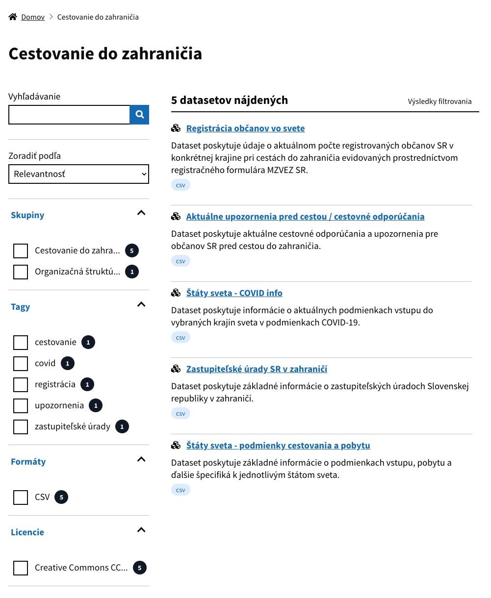
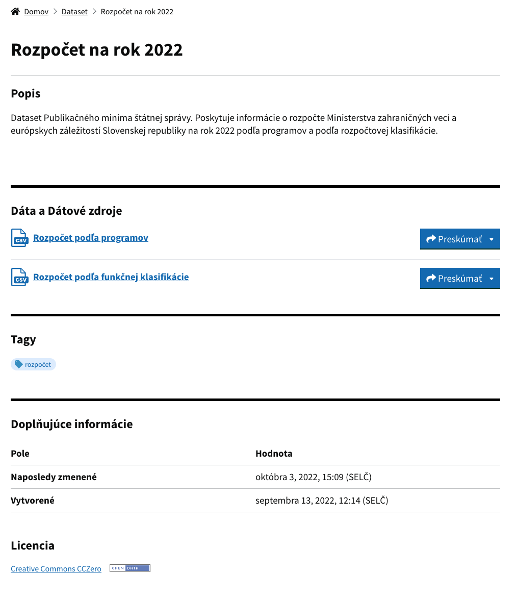
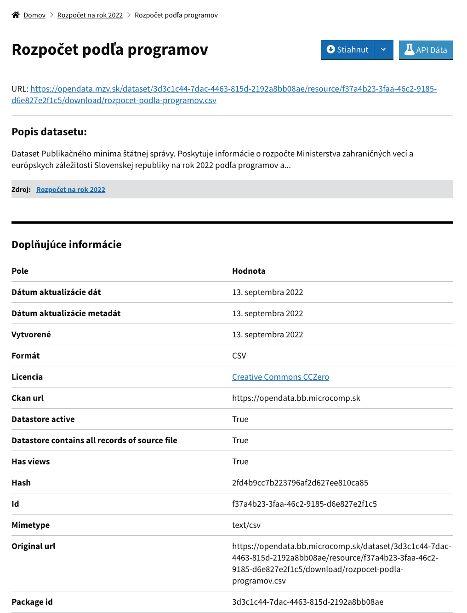
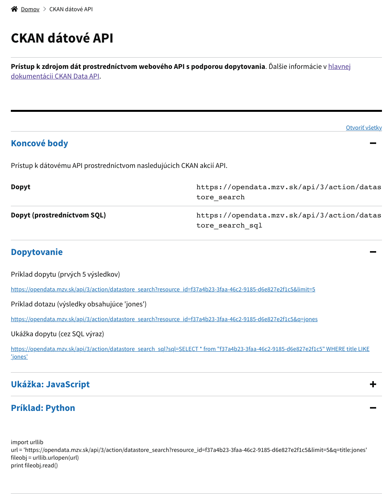
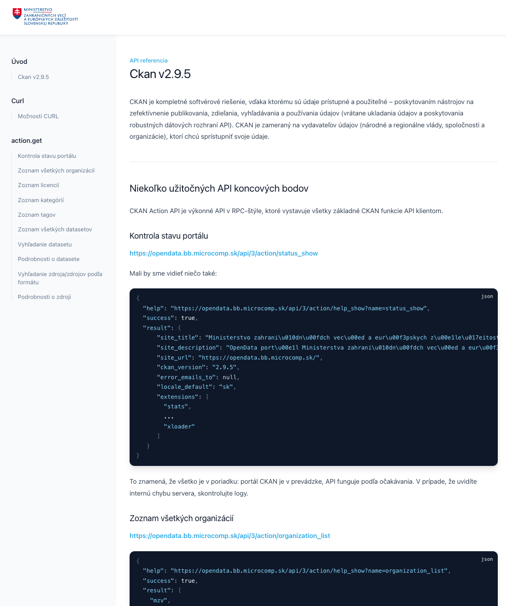

# Open Data údaje MZVEZ SR
### O projekte

Portál [opendata.mzv.sk](opendata.mzv.sk) bol vytvorený za účelom sprístupnenia otvorených údajov
z činnosti Ministerstva zahraničných vecí a európskych záležitostí SR.
Obsah portálu tvoria datasety v strojovo spracovateľnej forme podľa štandardov poskytovania
údajov v elektronickom prostredí v súlade s Vyhláškou č.78/2020 o štandardoch pre informačné
technológie verejnej správy. Obsah portálu a podmienky jeho použitia poliehajú licencii
Creative Commons CC0.

**Kontakt**:
[opendata@mzv.sk](mailto:opendata@mzv.sk)

---

#### Úvodná stránka portálu

---

#### Katalóg s filtrom

---

### #Detail datasetu

---

#### Detail dátového zdroja

---

#### API

---

#### API dokumentácia / CURL syntax

